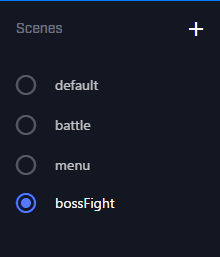
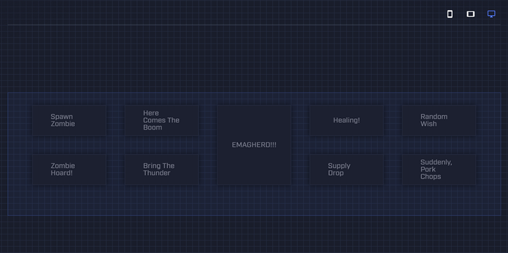

## Introduction

MixPlay enables viewers, also known as participants, to directly control the environment in and around streamer’s broadcasts by interacting with user interface controls. When a broadcast has interactivity enabled, controls appear beneath the video on the viewer’s screen. These controls dynamically change according to live events and update in response to different situations that occur within the broadcast.

Developers and producers can create interactive experiences which can run as a part of a game, entirely as a standalone application, or as a tool. These experiences are then used by broadcasters to make their broadcasts interactive.

When a viewer interacts with the controls, their input is sent directly to the experience, allowing the developers to see exactly who is interacting and what they are doing. This level of engagement allows for the creation of truly unique and interactive experiences that let viewers and broadcasters experience Mixer broadcasts on a whole new level.

## Getting Started

Interested in making an Interactive Project? Let's get started!

### Prerequisites
Before you begin, we recommend that you have:

- [A Mixer user account](https://watchbeam.zendesk.com/hc/en-us/articles/208104776-Creating-an-Account)
- Some knowledge of programming, unless you're using an existing Game Client or Interactive Application
- An awesome idea or existing code base or game to work from

### Choose a SDK

If you're making a Game Client from scratch, you'll need to use an Interactive SDK.

| Environment | Repository / Download | Documentation | Description |
| ----------- | ----------------------|---------------|-----------------|
| Typescript, Node.js & Browsers | [GitHub](https://github.com/mixer/interactive-node) | [API Reference](https://mixer.github.io/interactive-node) | Great for creating Interactive tools and utilities. Suitable for beginners. |
| C++ | [GitHub](https://github.com/mixer/interactive-cpp) | [API Reference](/reference/interactive/cplusplus/index.html)  [Docs & Getting Started](https://aka.ms/MixerCPPDocs) | Add Mixer Interactive features directly into a C++ Game. |
| Unity | [Asset Store](https://www.assetstore.unity3d.com/en/#!/content/88585) | [API Reference](/reference/interactive/csharp/index.html)  [Docs & Getting Started](https://aka.ms/MixerUnityDocs) | Add Mixer Interactive features into a game created using Unity. Also great for quickly prototyping an Interactive Idea.
| Unreal Engine 4 | [GitHub](https://github.com/mixer/interactive-unreal-plugin) | [Documentation and Getting Started](https://aka.ms/MixerUnrealDocs) | Add Mixer Interactive features into a game created using Unreal Engine 4. |
| Java | [GitHub](https://github.com/mixer/interactive-java) | [API Reference](https://mixer.github.io/interactive-java) | Add Mixer interactive to your Java project. |

Download the appropriate SDK that your project needs from the repository and create a new project in your favorite IDE.

### Create a new Interactive Project

Interactive projects are created and configured in the [Developer Lab](https://mixer.com/lab/interactive).

Go to the [Developer Lab](https://mixer.com/lab/interactive) and click on the **plus** button to create a new project.

You'll then be prompted to enter a name for your project. Enter a suitable name for your project.

After creating the project, you can still modify your project using the editor.

### Configure, build, and publish the project

The project editor contains tabs where each tab is a step in the creation of your project. Use the project editor to configure, build, and publish your project.

The editor consists of these four tabs:

- Info - Edit the project name and metadata
- Build - Configure Scenes and Controls
- Code - Hook your Game Client up to the Project and start coding
- Publish - Submit your project for review by the Mixer team.

### Info
The info step is your opportunity to describe your project and provide potential users with all the information they need to get up and running.
It is important to describe what your project does and how to install it in a clear and concise way so that users understand what you have developed and how to use it. Be sure to include some information on how users can contact you if they need help or want to report an issue.
During the pre-publish review process, the Mixer team examines your project more closely. We use this information to gain an understanding of what your project does, so be as thorough as possible.

### Build

The build step is where you design your scenes and controls for your project. The interface is divided up into three sections:

- Scenes
- Controls
- Grid

#### Scenes section

This is where you'll manage the scenes for your project. Scenes can be created, renamed, or deleted here. You can also select a specific scene that you would like to manage controls for.

#### Controls section

This is where you'll manage the controls in your project. You can create, rename, change the type, adjust properties, or delete controls here.

#### Grid section

The grid is how you specify the layout of your controls for the scene. There are three different layouts for which you can set the look of the scene: small (mobile phones), medium (tablets), and large (desktops). These different layouts are indicated by icons in the upper left area of the grid section.

To add a control to the grid, click and drag the control from the Controls section on to the Grid section. Once the control has been added to the grid you have the ability to resize, reposition, or remove the control.

For more detail on the configuration of the controls on the scene, the `View JSON` option in the top right of the grid section will display the relevant JSON for the scene.
Once you are finished building your scenes/controls, press the Save button in the top right of the grid section.

### Code

The code step is to help you complete the code portion of your project. This is usually done after you have set up the scenes and controls. This is also where you can grab the `Project Version ID` which is displayed in the center of the screen.

You will need to write your own Game Client to connect to the Interactive service. For SDK downloads, documentation, and samples, go to [Choose a SDK](#choosing-an-sdk-environment).

### Publish

The final step in the studio is Publish. Publish allows you to share your project with everyone on Mixer.

To help you decide whether your Interactive project is ready for publishing, these are some questions to ask:

- Is your project something that everyone would use?
- Is your project ready for every Mixer broadcaster to have access to?
- Have you filled in the Info tab with **detailed** installation and setup instructions?

If you’ve answered no to any of the questions above, you should **not** publish your project yet. If you would like to have a small group of users to be able to access it, consider [sharing](#sharing-your-project) your project instead.

#### Understand the Publishing Flow

A Project starts off as a draft. In this state, you are free to edit, test, and share it with other users. Many projects don't leave the draft state. It's perfectly ok not to publish your project.

When you've decided to publish your project, go to the Publish tab in the interactive studio. It will perform some checks on the project to ensure that it meets some basic requirements before allowing you to click on the Submit button.
Once you've submitted your project, the Interactive review team at Mixer is notified, and we will begin the review process. While a project is in review, you won't be able to edit the project. A Mixer representative may also reach out to you with questions.
After a review is conducted, you'll be notified whether your project is accepted for publishing or not. If your project is not accepted for publishing, it goes back to the draft state with feedback from the team, detailing what needs to change so that your project can be successfully published.
Once your project is accepted for publishing, we can start discussing the actual launch date; when you would like to make your project available for all Mixer users in the Interactive Store.

## Where to get help

Have questions? Stuck? We're here to help! We have places you can get help so drop by!

- [Gitter](https://gitter.im/Mixer/developers) - Chat with our team and other developers.
- [Community Discord](https://discord.gg/mixer) - Hang out with other developers in our community Discord.
