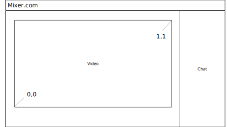

# Mouse

! The Mouse control cannot be used with other controls including Buttons.

Mouse input allows you to get mouse events over video. When a Mouse control is added to a scene it will create a rectangle that covers the video. When a Participant moves their mouse over the video events can be sent down to your Game or Application.

This control is useful for drawing or pointer style experiences.

## Properties

The Mouse control has a number of properties that change its behavior:

- Send Move Events
    - `mousedown` (default) - this will only send mouse move events during a mousedown event
    - `always` mouse move events are sent on hover and during mousedown
    - `never` never send mouse move events.  You will still receive click events.
- Move Throttle - Will throttle movement events sent to the game client.  The default is 50ms.
- Send Mouse Down Event - When checked it will send mouse down events
- Send Mouse Up Event - When checked it will send mouse up events

## Placement

The mouse control is unique in that you cannot place the mouse control on a grid. This is because when it is added to a scene it loads over the video and is automatically sized to match the size of the video.

## Coordinates

Regardless of device or screen size, screen controls operates on a coordinate system where the bottom left of the video is x:0, y:0 and the top right is x:1, x:1. The middle of the video is 0.5, 0.5.

## Translating Coordinates to your Application / Game

When you receive coordinates from a mouse event you will usually need to translate this to a location within your Game or Application world. Doing this is quite easy.

First make sure that you're using the same coordinate system as us. The Origin should be at the bottom left of your window.

Then you can apply the following to each coordinate to translate them into your coordinate space:

- For X - take the width of your Game / Application's window and multiply it by the X coordinate
- For Y - take the height of your Game / Application's window and multiply it by Y

