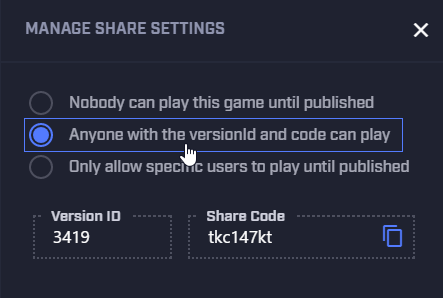

# Managing Project Access

By default, only the owner of an Interactive project can use the project in a broadcast, access it from an SDK, or make edits to it within the Interactive Studio. The goal of this restriction is to protect your project and ideas from access by unauthorized users. Mixer provides several options to expand project access to different groups of people in order to let them use the project or edit it.

## Sharing an Interactive Project
By default, you are the only person who can broadcast the project. Other users will receive a `4020` Error code with the message: `The interactive version is not found, or you do not have access to it`

You have several options if you'd like other users and developers to be able to use your project. These options are managed in the project's share settings.

To open these settings, click the Share icon on the top right of the Studio, as shown in the screenshot below.

You'll be presented with a dialog with three options. **Changing the sharing settings of a project will delete any previous share settings.**

The first option, "Nobody can play this game until published", is the default. Selecting this option allows only the project owner to use the project in a broadcast until it is published. If you haven't opened these settings before, this will be the selected option.

### Share Codes
The second option, "Anyone with the versionId and code can play", generates a share code. Share codes can be saved within your SDK's configuration and stored within your project's source control system. It can then be built into any in development builds of your project. Using this option allows for anyone in your team to easily work on the project.

You can also optionally give out this share code to smaller audiences to test or trial your project. If you do this, you'll have to create a user interface or command within your game or application that can take this Share Code and pass it to your SDK of choice as a part of the SDK initialization.

Once a share code has been set, it is very important to not change the radio button in this setting screen. If you do, it will delete the share code and potentially lock out other users or members of your team from the project.

Once a project has been [published](/guides/mixplay/introduction#understand-the-publishing-flow), you will not need the share code anymore. At this point **any** Mixer user will have access to the project. **Please ensure you go through the publishing process before your application or game is shipped to the public**.

### Explicit Sharing

The third option, "Only allow specific users to play until published", is called explicit sharing. It lets you share the project with named Mixer users. Only users in the list can use the project. To share a project with a specific user, search for their username in the search box and then click "Add".

The user **must** have a Mixer User account for you to be able to share it with them. You can use this setting to share a project with a limited audience or with members of your team.

Changing this setting will **delete** the list of authorized Mixer Users.

## Adding Project Editors

If you'd like other members of your team to be able to edit your Interactive project in the Interactive Studio then you should add them as a Project Editor. You can do this by clicking the project editors button in the studio.

In the dialog that opens you can search for other Mixer users and add them to your project as an editor. Once added, you can also remove them.

Users added to this dialog will see your project in the project list of the studio. They can then edit the project as though they owned it.

## Project Access Best Practices

### Project Sharing

- Use Explicit sharing for very small audiences.
- Use Share Codes when your audience grows larger.
- Include your share code into your project's version control system. This way it'll be shared with anyone working on the project.
- Avoid changing your share code after one is in use. This will potentially lock out other people on your team.
- Before releasing your Game, [Publish your project](/guides/mixplay/introduction#publish).

### Project Editors
- Create your project on an account for your Studio, for example: "Mixer". This will make it look more professional when published.
- Add your Team's developers as Editors.
- Regularly review the editor list to ensure correct permissions.
