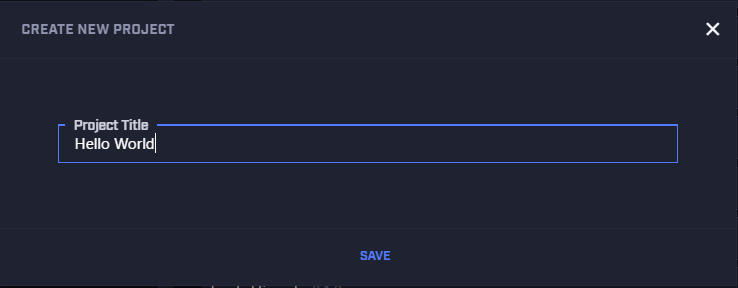

This article explains how to use the plugin to create an interactive game project in Unity. An interactive game enables viewers to directly control the environment in and around streamers' broadcasts by interacting with the UI controls displayed.

* Open the **Mixer** menu and select **Interactive Studio**.
* Create a new project and name it "HelloWorld". Then click **Save**.


* Click the **Build** tab at the top of the **Interactive Studio Editor** as shown in the screenshot below:


* Add a new control. Make sure the control type is set to button (this is the default). Name the button "GiveHealth". This is the string is referenced in the game code.


* Drop the button on the grid.
* Click **Save**.

## Import Mixer SDK into Unity

* Download the Mixer SDK from the [Unity Asset Store](https://www.assetstore.unity3d.com/#!/content/88585).
* Open the Unity Editor and select: **Assets** > **Import Package** > **Custom Package**. Locate your downloaded SDK package, select the package, and click **Open**. Leave all the files checked and click **Import** as shown in the screenshot below:


* If the import process is successful, a MixerInteractive folder will be created under the **Assets** folder in your Unity project.

## Create your first Mixer Interactive scene

* In the Unity editor, go to **Mixer** > **Prefabs**, and drag the **InteractivityManager** prefab into your scene. We recommend that this prefab be the first asset you add into the scene.


## Link your game to the Mixer service

* Go to the **Code** tab at the top of the **Interactive Studio Editor**.


* Copy the **Project Version ID** to your clipboard.
* Open the **Mixer** menu and select **Open Mixer Editor**.
* Paste the **Version ID** from the earlier step into the **Version ID** field of the Mixer Editor.
* Go back to the **Code** tab at the top of the **Interactive Studio Editor** and click on the go to **Developer Lab** link.


* In Developer Lab, click on the **Manage OAuth** button to go to the OAuth Clients page.
* On the OAuth Clients page, create a new OAuth client with the following information:
    * Name: MyOAuthClient
    * Website: http://mixer.com
    * Hosts: *.mixer.com
* Copy the **OAuth Client ID** of the newly created client.
* Go back to the Unity editor and open the Mixer Editor. Paste the **OAuth Client ID** into the **OAuth Client ID** field.
* Click on the **Save project information** button to save the settings.

## Add interactivity into your scene

* Go back to your scene in Unity and create a new empty **GameObject** in the hierarchy window.
* Click on the newly created **GameObject** and then click on the **Add Component** button. Add a new C# script and name it HelloMixer.cs.
* Open the newly created HelloMixer.cs script. Add **MixerInteractive.GoInteractive()** to the **Start** function as shown below. **MixerInteractive.GoInteractive** is the API method to connect to the interactivity service.

```
void Start() {
    MixerInteractive.GoInteractive();
}
```

* Go to the **Update** function and add a call to receive input from the "GiveHealth" button you've created earlier.

```
void Update() {
   if (MixerInteractive.GetButton("GiveHealth")) {
       Debug.Log("Player health increased.");
   }
}
```

## Test your game

* To test your set up, click on the **Play** button in the Unity editor.
* Follow the instructions and enter the displayed code at [http://mixer.com/go](http://mixer.com/go).
* Open a web browser and go to your Mixer channel: http://mixer.com/<your channel name>.
* Click on the "GiveHealth" button.
* If you have the Unity console open, you'll see "Player health increased." printed on the console.

## Next Steps

There are example scenes that demonstrate each feature under MixerInteractive\Examples. Each scene has an instructions.txt file next to the scene. You can follow the instructions in the file to learn about the feature.

## Additional common next steps
If you are shipping an Xbox One game, we encourage you to take the following steps.

### Share Codes
If you want to share a build of your game with others. For example, you want to give a demo of your Mixer integration to a publisher, we recommend using share codes. Learn how to use share codes [here](https://github.com/mixer/interactive-unity-plugin/wiki/Using-Share-Codes)    

### Test streams
If you are shipping your game on Xbox One and want to test your Mixer integration without others seeing your game, you can use the test streams feature. To get access to Test Streams, send an email with to mixerdevinfo@microsoft.com with the following information:
* Your Xbox Live sandbox
* The mixer channel names of the accounts you will be broadcasting from

Once you have access, you can read more about the feature [here](https://watchbeam.zendesk.com/hc/en-us/articles/115005120666).

### Mixer and Xbox One
If you are shipping a game for Xbox One and doing Mixer, we strongly encourage you to read the [Mixer and Xbox Live](https://github.com/mixer/interactive-unity-plugin/wiki/Mixer-and-Xbox-Live) article. It covers common questions developers run into when trying to develop Mixer integration for an Xbox One game.