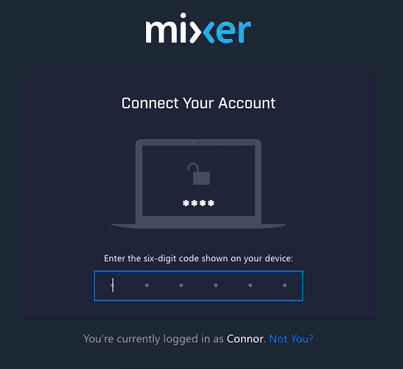

When we released [custom controls for MixPlay](https://dev.mixer.com/guides/mixplay/introduction), we also published a new type of OAuth flow we called the "shortcode oauth" flow. This lets users visit Mixer using any device and enter a code shown in your game or app to link their accounts. This is an easier and more friendly flow than traditional OAuth, which either requires you to embed and browser and 'capture' the redirection (which can be difficult and requires the user to log in again in your app) or run a local webserver on the user's device (which has security implications and can be broken by antivirus programs).

Today we published a set of client libraries in C# and Node.js to easily use shortcode OAuth in your app.

| Language | Repository | Installation |
| ----------- | ----------------------|---------------|-----------------|
| Typescript, Node.js | [GitHub](https://github.com/mixer/shortcode-oauth/tree/master/nodejs) | `npm install --save @mixer/shortcode-oauth` |
| C# (.NET Standard) | [GitHub](https://github.com/mixer/shortcode-oauth/tree/master/csharp) | `nuget install Microsoft.Mixer.ShortcodeOAuth` |

Check out the [Shortcode reference](/reference/oauth/shortcodeauth) for more information, chat with us on [Gitter](https://gitter.im/Mixer/developers) or the [Community Discord](https://discord.gg/mixer) if you need any pointers, or [open a Github issue](https://github.com/mixer/shortcode-oauth/issues/new) if you find any problems!
